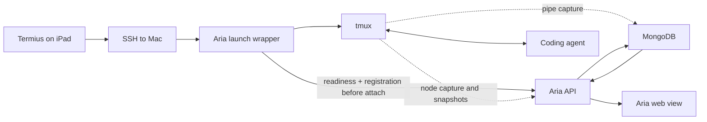

# Aria Shells performance and architecture review

Date: 2026-09-07 (measurements continued after 02:00 UTC on September 8).
Scope: the Mac-hosted Aria shell feature, Termius/iPad attachment, and native agent resume. This is a targeted review, not a load test of every Aria subsystem. Running coding sessions and their capture settings were left intact.

## Decision

Aria Shells is useful but is not currently optimal. It provides live process continuity, a fleet view, remote control, searchable output, and integration with Aria's agents. For Ben's interactive iPad workflow, its synchronous attachment dependency and overlapping observation paths impose unnecessary complexity. Those parts should be simplified rather than making every coding session depend on the full control plane.

Recommended architecture: **tmux owns live processes; each coding agent owns its saved conversation; Aria observes and indexes asynchronously.** A local attachment should succeed even while Aria or MongoDB is unavailable.

Native `/resume` complements tmux. It restores a saved conversation; it is not a substitute for preserving the currently running terminal, process, and child jobs through an SSH disconnect. The official Codex documentation describes reopening saved transcripts with `/resume` and `codex resume`. The upstream tmux documentation describes detaching and reattaching running programs across connection drops. Sources: [Codex commands](https://learn.chatgpt.com/docs/developer-commands?surface=cli), [tmux getting started](https://github.com/tmux/tmux/wiki/Getting-Started).

| Capability | Native agent resume | Plain tmux | Current Aria Shells |
|---|---|---|---|
| Reopen saved conversation after process exit | Yes | Requires agent resume | Via agent launcher/manual resume |
| Preserve an active process through SSH disconnect | Does not provide a persistent terminal | Yes | Yes, supplied by tmux |
| Reattach from another device | Reopen history in an agent | Attach to the same running process | Managed attachment to tmux |
| Cross-agent fleet view, central capture and remote commands | Agent-specific | No Aria integration by itself | Yes |
| Needs Aria/MongoDB to reconnect | No | No | Current local wrapper waits for Aria |

## Current paths

After attachment, Termius keystrokes travel through SSH and tmux directly to the agent. They do **not** make an Aria API or MongoDB round trip. Consequently, the five-second web polling interval does not explain delayed typing in Termius; it explains delayed display in the Aria web UI.

## Confirmed findings

### 1. Existing-session attachment unnecessarily depends on API readiness

[scripts/aria-local-shell](../../scripts/aria-local-shell) derives a deterministic session name, then reads the API key, waits for readiness, and POSTs shell registration before attaching. It does not first attach to an already-live local tmux session. Its default startup deadline is 300 seconds, with readiness and registration request timeouts of 5 and 15 seconds. This is a real failure dependency, although it does not mean every healthy attachment takes minutes.

Change: check the exact local tmux session and live pane first, then exec attach/switch immediately. Observe/register in the background. Use the API creation path for a genuinely new session, not as a prerequisite for rejoining an existing one.

### 2. Two Mac node roles compete to own the same panes

The deployed `com.aria.node` service reports `bens-macbook-pro` in control mode. The deployed `com.ben.devbox.aria-agent-node` reports `mac-agents` in full mode. Both run `aria.node`, default to the same `claude-` prefix, and capture the same tmux server. Pipe-pane capture is also active on all nine observed panes.

[NodeAgent](../../api/aria/node/agent.py) runs capture in every command mode, nominally every two seconds after each scan. Node heartbeat/snapshot/event ingest calls [register_shell](../../api/aria/shells/service.py), whose explicit host update overwrites the existing host. In a 9.6-second sample, the Development shell changed between `bens-macbook-pro` and `mac-agents` three times.

That affects behavior: local shells use direct tmux operations; shells considered remote use node snapshots and a command queue. [current_screen](../../api/aria/shells/service.py) returns a node's stored snapshot for a remote shell. During repeat probes, the same screen endpoint varied from 3.7 KB to 25.8 KB, consistent with switching between viewport capture and the larger stored snapshot.

Change: assign one authoritative owner and capture writer per physical pane. Keep logical execution roles separate from physical shell identity. A Mac command worker can remain available without also recapturing every human session. Do not simply stop the full node service: active Aria coding sessions use its command queue.

### 3. The web terminal is deliberately delayed

[TerminalView](../../ui/src/features/shells/TerminalView.tsx) uses the `live` SWR tier for screen mode, which is **5,000 ms** in [swr.ts](../../ui/src/lib/swr.ts). The active shell list uses the 10-second tier. The existing follow view uses SSE, but the API still polls MongoDB every 500 ms, after capture's nominal 500 ms flush window. These are cumulative delays, plus scheduling and rendering.

Change: use one bounded stream of changed output/screen state for the visible shell, coalesced around 50–100 ms, with backpressure and reconnect cursors. Keep periodic polling for fleet metadata. Do not replace five-second polling with aggressive database polling from every client.

The web UI already has useful optimizations: memoized panes/rows, coalesced follow buffers, lazy loading of stopped shells, and paused polling/streams in hidden tabs. Preserve those. The actual active-list request is only about 6.7 KB; the 328 KB unfiltered history response is not the ordinary active-list payload.

### 4. The iPad and desktop clients have different rendering constraints

Development and ProjectAria have simultaneous 171×45 desktop and 200×51 iPad attachments. Their windows use `window-size smallest`, producing the smaller pane and unused dotted area seen in the screenshot. The policy is intentional: it avoids focus-driven resizes and repeated agent transcript reflow.

The desktop tmux clients advertise synchronized output; the iPad/Termius clients do not. This is a plausible contributor to visible incremental repainting, not proof of the entire reported lag. The current Codex launcher already disables animations, uses inline output, and limits resize reflow to 250 rows for newly launched processes. Some existing processes predate that last argument. Repeatedly reconnecting with native resume can itself require transcript reconstruction; it is not automatically faster than reattaching a healthy live process.

Change: make sizing ownership explicit. Use one interactive sizing client and let passive viewers ignore sizing, or offer a session-scoped takeover. Avoid repeated focus/viewport resizes. Do not force unsupported terminal features or restart working agents just to apply a display preference.

### 5. The tailnet path is direct, with some latency variation

Five Tailscale pings to the iPad measured 14, 15, 41, 102 and 73 ms. Each used a direct path; the peer's `Relay: nyc` status field alone would have been misleading. This sample shows jitter but does not establish sustained poor throughput or multi-second network stalls. [Tailscale's connection documentation](https://tailscale.com/docs/reference/connection-types) explains using ping output to distinguish direct and relayed paths.

## Measurements and limits

| Read-only check | Result |
|---|---|
| Active shell list, 8 requests | 19.87 ms median; 156.07 ms max; 6.7 KB |
| Development screen, first 6 requests | 45.0 ms median; 60.0 ms max |
| Development screen, later 8 requests | 149.82 ms median; 167.77 ms max; 3.7–25.8 KB |
| Local tmux capture, 20 requests per size | Medians 32–123 ms; maximum 306 ms across groups |
| Development host ownership, 24 samples | 3 transitions in about 9.6 seconds |
| Development stored output, 3-minute window | 39 pipe events / 29.9 KB; 22 snapshots / 936 KB |
| iPad direct tailnet ping, 5 samples | 14–102 ms; median 41 ms |

These are small live-system samples. The Mac was also serving other coding work; the earlier API sample overlapped a UI build. The inconsistent tmux timings are not a scaling curve. No iPad keystroke-to-paint instrument or controlled Termius-versus-another-client test was run. Capture failures causing pipe backpressure were not reproduced. Duplicate ownership and fixed refresh delays are confirmed; the complete cause of Termius typing lag remains partly unmeasured.

## Implementation order and acceptance criteria

1. Add the local existing-session attach path. Test with Aria unavailable; require successful attach without an API wait. Target under 250 ms local wrapper overhead on this Mac, measured separately from SSH.
2. Remove competing capture/ownership paths while preserving node command routing. Require a stable physical owner through reconnects, one writer per pane, and no lost live-session control.
3. Stream visible-shell changes. Target under 250 ms additional local display delay under normal load, with bounded memory, slow-consumer behavior, and hidden-tab suspension.
4. Add explicit sizing/takeover behavior and measure typing, scroll, resize, and reconnect on the actual iPad.
5. Keep raw terminal history as short-lived operational evidence. Prefer native agent session IDs and structured transcripts for durable conversation history and resume links.

Those latency numbers are acceptance targets, not promises or measured improvements. No shell performance changes were deployed as part of this review. Red fleet registration was completed separately.
